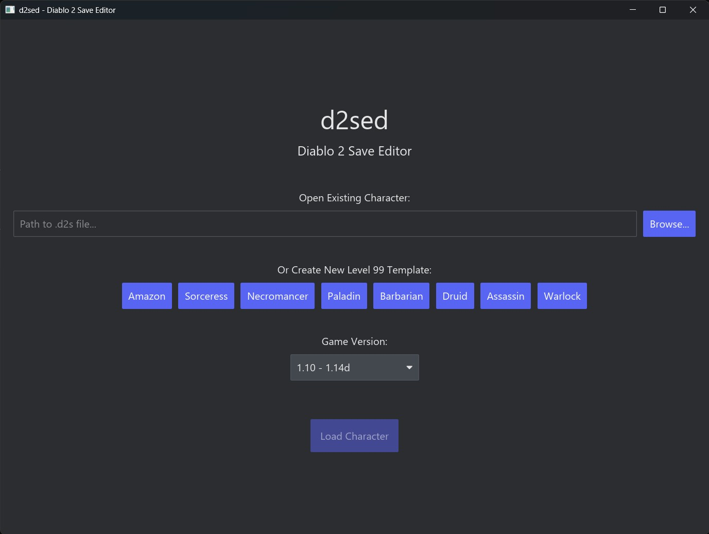
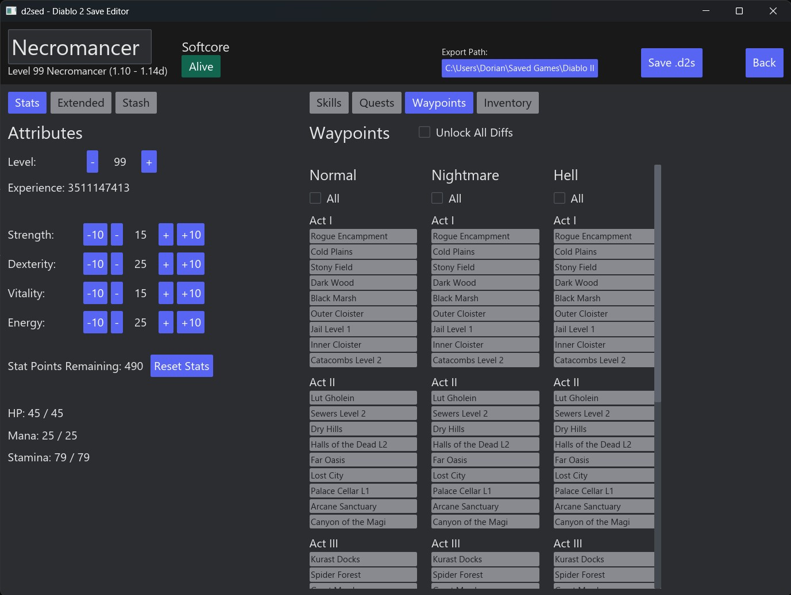

# d2sed

A compact Diablo II save editor for building and adjusting characters in accordance with game mechanics.  
Built as a testbed for [libd2](https://github.com/dorianprill/libd2) savegame de/serialization.

## Features

Tested with Diablo II Lord of Destruction 1.14d:

- [x] Load, edit, and save legacy `.d2s` files
- [x] Generate level 99 class templates
- [x] Edit level, experience, core stats, stat points, skills, and skill points
- [x] Reset stats and skills
- [x] Complete quests across Normal, Nightmare, and Hell, including difficulty unlocks, Izual skill rewards, Anya resistance scrolls, and quest history state
- [x] Unlock waypoints across all difficulties
- [x] Edit inventory and stash gold within in-game caps

Not supported yet:

- [ ] Item, equipment, inventory, and stash contents editing
- [ ] Diablo II: Resurrected saves
- [ ] Reign of the Warlock saves
- [ ] Full save validation beyond the currently edited fields
