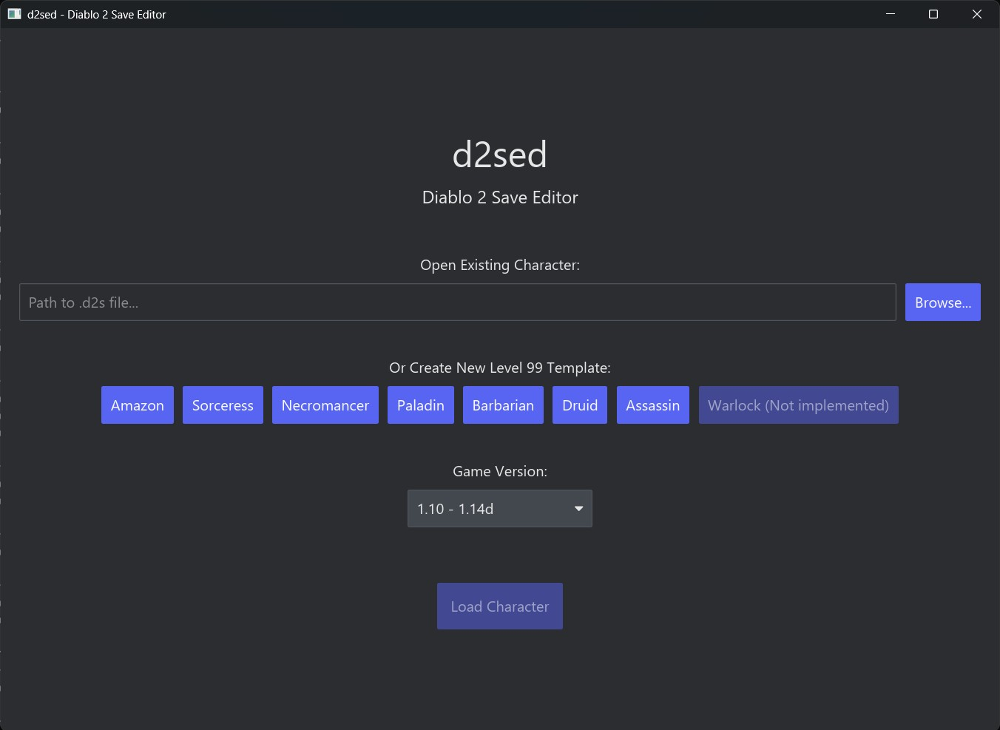
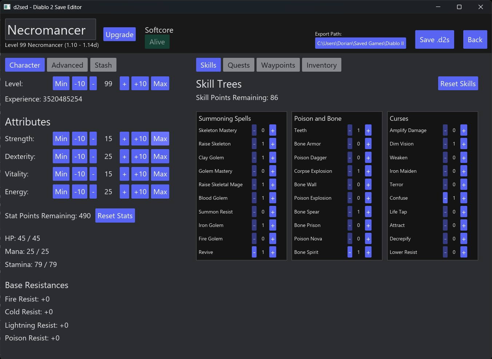

# d2sed

A compact Diablo II save editor for building and adjusting characters in accordance with game mechanics.  
Built as a testbed for [libd2](https://github.com/dorianprill/libd2) savegame de/serialization.





## Features

Tested with Diablo II Lord of Destruction 1.14d and Resurrected 3.2:

- [x] Load, edit, and save legacy `.d2s`, D2R, and Reign of the Warlock v105 saves
- [x] Reign of the Warlock support for character detection, class-id 7, skill base 373, template generation, and supported stat/skill/quest/waypoint/gold edits
- [x] Generate level 99 class templates for all classes
- [x] Edit level, experience, core stats, stat points, skills, and skill points
- [x] Reset stats and skills with prerequisite validation
- [x] Complete quests across Normal, Nightmare, and Hell, including difficulty unlocks, Izual skill rewards, Anya resistance scrolls, and quest history state
- [x] Unlock waypoints across all difficulties
- [x] Edit inventory and stash gold within in-game caps

Not supported yet:

- [ ] Item records or item properties, including equipped gear, inventory, belt, cube, personal stash, and shared stash contents
- [ ] Followers, mercenaries, summons, corpses, Iron Golem payloads, or RotW follower block editing
- [ ] Shared stash `.d2i` loading or saving
- [ ] Item import/export, item generation, or low-level item bitstream editing

## Build Instructions

To build `d2sed` from source, you need a Rust toolchain (2024 edition).

**Important:** Currently, `d2sed` depends on a local version of `libd2`. You must have the `libd2` repository cloned at the same root level as `d2sed`:

```
/your-root
  ├── libd2/
  └── d2sed/
```

Then, run:

```powershell
cd d2sed
cargo build --release
```

The resulting binary will be in `target/release/d2sed.exe`.
